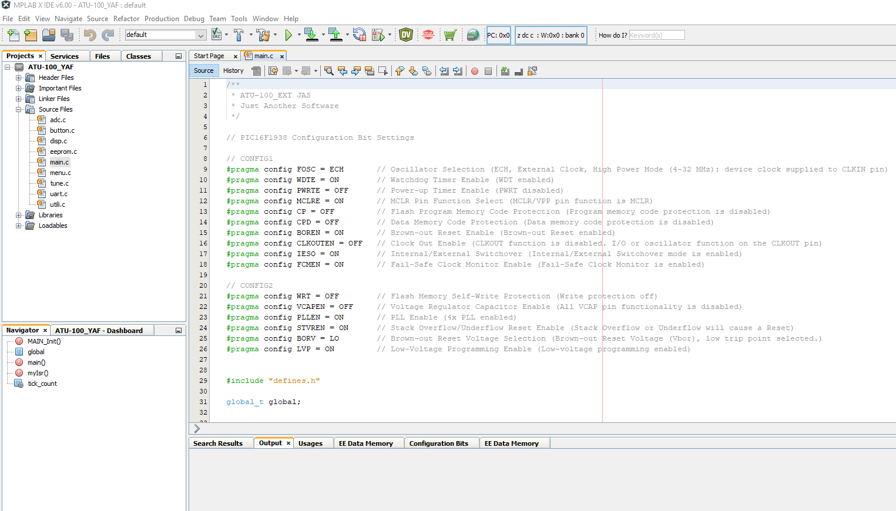

# Antenna tuner - ATU-100 EXT - Yet Another Firmware


## Motivation
After I have bought a Chinese clone of N7DDC Antenna tune ATU-100 EXT I wasn’t really satisfied.
The tuner was not able to work with my QRP transmitter. Also the shown power was very inaccurate.
I have seen some room for improvement in the firmware. Unfortunately the original firmware of N7DDC was written under the mikroC IDE that is not available for free. So I decided to start the project from scratch with the Microchip MPLAB X IDE.

## The original project by N7DDC
https://github.com/Dfinitski/N7DDC-ATU-100-mini-and-extended-boards

## Imported Notes
This firmware only works with the ATU-100_EXT (7x7) hardware, the PIC16F1938 MCU and the OLED Display 128x64px.
Before you start please make a backup of the original firmware and be sure that you can restore it.
```diff
- You act at your own risk!
```
## Features
+ Function menu on display – one button operation
+ 10 memory slots for tune-settings one of them as a startup setting
+ Calibration function for the integrated power meter
+ Configurable Auto-Tune function
+ Sleep function for battery saving
+ Temporary Bypass function 

## Button functions
**Button short pressed:** _____ *Start Tuning or select next item* 

**Button long pressed:** ______ *Enter Menu or change value* 

## Menu-tree
+ Bypass ______*Temporary bypass the current tune settings*
+ Load Tune __ *Load tune setting from memory slots*
+ Save Tune __ *Save the current tune settings in 10 memory slots*
+ Reset ______ *Reset the current tune settings*
+ Setup
     - Tuning _____ *Set tune parameters (Auto tune on/off)*
     * Sleep ______ *Set sleep mode and time*
     * Calibrate __ *Calibrate the power measurement at two points*
     * Test _______ *Test function for each relay*
+ About ______ *Who did it*

## Calibration
The firmware includes a two point calibration function for the integrated power meter.
It is recommend to calibrate on the lowest (max 10W) and highest (max 100W) used power level.
For calibration you need a transmitter with adjustable TX power and a dummy load.


## Programmer
For programming a PICkit3 programmer is used.
When the ATU-100 is switched off, connect it in the shown way.
After that switch on the ATU-100.


## Programming Tool
If you only like to flash the firmware you can use the Microchip Integrated Programming Environment
**MPLAB X IPE**.
The needed hex-file you find in the *dist* folder.


## Development IDE
For development the Microchip **MPLAB X IDE v6.00** was used.
The IDE is available for free on the Microchip web side.


